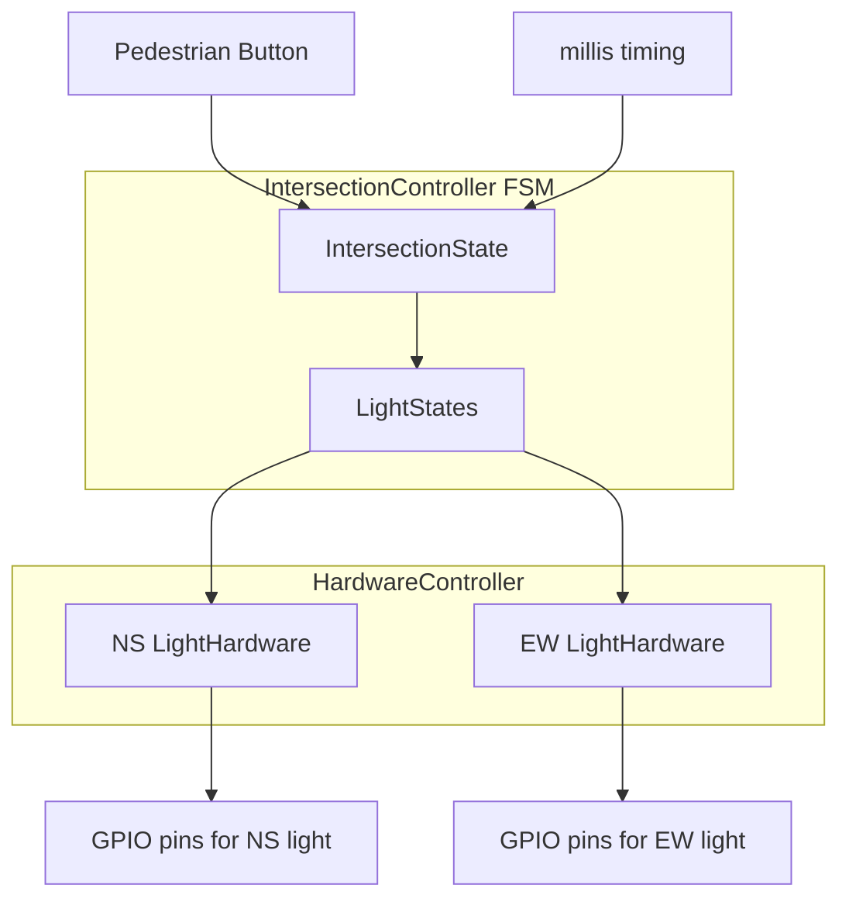

# Overview

This project is a finite state machine-based traffic intersection controller using a layered abstraction model.

## Demo

Two traffic lights cycle through phases, with optional pedestrian input controlling one direction.

TODO: gif

## Key Features
- A non-blocking traffic light program (FSM) on an Arduino.
- Models two opposing traffic lights at an intersection.
- Includes interrupt-driven pedestrian input for one direction.
- Code is structured to separate the control logic from hardware.
- Includes a very small test harness.

# Architecture

## Overall Behavior

The controller runs continuously in a loop:
1. Reads time and any external events (pedestrian button press)
2. Updates FSM state (`IntersectionState`)
3. Produces `LightStates` output
4. Applies hardware updates only on change

## System Overview

The intersection is modeled as an FSM because it is deterministic, and driven by time and external events. The system is divided into three layers:

- **IntersectionController (FSM)**  
  Handles timing and (overall intersection) state transitions, and emits the current state of the lights.

- **HardwareController**  
  Translates FSM output (`LightStates`) into actions on individual `LightHardware` objects.

- **LightHardware (driver layer)**  
  Directly controls Arduino GPIO pins.



## Finite State Machine

The overall intersection logic is a FSM with the following states. "NS" indicates the North-South direction's light, and "EW" the East-West direction.

- `NS_GREEN_EW_RED`
- `NS_YELLOW_EW_RED`
- `BOTH_RED_TO_EW`
- `NS_RED_EW_GREEN`
- `NS_RED_EW_YELLOW`
- `BOTH_RED_TO_NS`

The program cycles linearly through these cycles, with timing determined by some constants in the code. The pedestrian button immediately transitions from `NS_GREEN_EW_RED` to `BOTH_RED_TO_EW`.

# Timing model

- No blocking delays, allowing the controller to remain responsive to external events (e.g., pedestrian interrupt) while maintaining deterministic timing.
- Time is measured using `millis()` (polling).


# Testing

Currently tested:
- State transitions
- Command outputs
- Time-based transitions

Not currently tested:
- Hardware timing accuracy
- ISR correctness under race conditions
- Real electrical behavior.

A very basic unit test suite is implemented at `tests/`. To compile the test function, run
```bash
g++ tests/test_controller.cpp \
    TrafficLight/TrafficLightController.cpp \
    -I TrafficLight \
    -o tests/test.exe
```
Then run the program with
```bash
./tests/test
```

# Hardware abstraction

The `LightHardware` class is a hardware abstraction layer (HAL) that isolates GPIO operations (e.g., `pinMode`, `digitalWrite`) from the FSM logic. A single `HardwareController` owns two `LightHardware`s, one for each direction.

# Design decisions/tradeoffs

- For timing, I chose a polling loop instead of using the processor's timers for simplicity and to keep focus on the design.
- The pedestrian button ISR only sets a flag to avoid heavier interrupt work.
- FSM outputs are only applied when the state changes to avoid redundant GPIO writes.
- The abstraction built into the class structure is intended to isolate the FSM logic from the hardware actions.
    - This also makes the code scalable in the sense that if we want to add more directions to the intersection --- say, a three-way intersection --- then we can just modify the `IntersectionController` and `HardwareController` classes.

# Architectural Limits

The current design is optimized for a fixed two-way intersection. Scaling beyond this introduces challenges in:

- Representing more complex signal phases
- Avoiding switch-case explosion in the FSM
- Generalizing hardware mapping beyond two directions

# Future steps

### Robustness

- Debouncing button input
- Race condition risk on volatile bool
- FSM not formally verified
- No scheduler abstraction

### Refactoring for Scalability

Here are some ideas for how to support system scaling:

- Extend the controller for `N`-way intersections
- Introduce a configurable FSM table (instead of switch-case logic)
- Think about how we would handle more exotic traffic lights! (turning arrows, etc.)